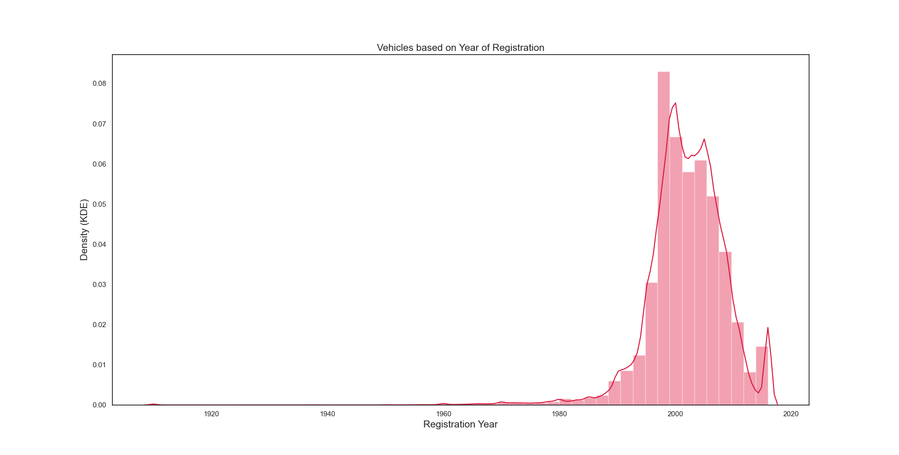

# Data analysis of used car database &nbsp;&nbsp;
Data Analysis or sometimes referred to as **exploratory data analysis (EDA)** is one of the core components of data science. It is also the part on which data scientists, data engineers and data analysts spend their majority of the time which makes it extremely important in the field of data science. This repository demonstartes some common exploratory data analysis methods and techniques using python. For purpose of illustration the **[used car database](https://www.kaggle.com/orgesleka/used-cars-database)** dataset has been taken from kaggle since it is one of the ideal dataset for performing **EDA** and taking a step towards the most amazing and interesting field of data science. Good luck with your _**EDA**_ on the _**used car database**_ dataset.
### DataSet Overview
  + The dataset is taken from **kaggle** and contains details of the **used cars in germany** which are on sale on **ebay**.
  + The dataset is not clean and hence a lot of data cleaning is carried out. For e.g. prices where too high which are      replaced by the median and outliers are removed accordingly. 
  + Also vehicles whose registration year was **_greater than 2016_ and _less than 1890_** were removed from the dataset as this data is inconsistense and would yield incorrect results.
  + The dataset is cleaned and stored in a **CleanData** folder which contains the entire cleaned dataset named as **[cleaned_autos.csv](CleanData/CleanedDataSet)** and another folder named **[DataForAnalysis](CleanData/DataForAnalysis)** containing files structures containing subsets of the cleaned dataset based on brand of the vehicles and vehicle types.  
  
### Sample Dataset
dateCrawled | name | seller | offerType | price | abtest | vehicleType | yearOfRegistration | gearbox | powerPS | model | kilometer | monthOfRegistration | fuelType | brand | notRepairedDamage | dateCreated | nrOfPictures | postalCode | lastSeen
--- | --- | --- | --- | --- | --- | --- | --- | --- |--- | --- | --- | --- | --- | --- | --- | --- | --- | --- | ---
2016-03-24 11:52:17 | Golf_3_1.6 | privat | Angebot | 480 | test | nan | 1993 | manuell | 0 | golf | 150000 | 0 | benzin | volkswagen | nan | 2016-03-24 00:00:00 | 0 | 70435 | 2016-04-07 03:16:57
2016-03-24 10:58:45 | A5_Sportback_2.7_Tdi | privat | Angebot | 18300 | test | coupe | 2011 | manuell | 190 | nan | 125000 | 5 | diesel | audi | ja | 2016-03-24 00:00:00 | 0 | 66954 | 2016-04-07 01:46:50
2016-03-14 12:52:21 | Jeep_Grand_Cherokee_"Overland" | privat | Angebot | 9800 | test | suv | 2004 | automatik | 163 | grand | 125000 | 8 | diesel | jeep | nan | 2016-03-14 00:00:00 | 0 | 90480 | 2016-04-05 12:47:46
***
### More Info
__*The main folder contains 9 folders*__.

  + Folders from Analysis1 - Analysis5 contain the **iPython Notebook**, **python scripts** along with the **Plots** for that analysis.
  + Folder for **[shell scripts](ShellScripts)** which automate the creation of files structures and splitting the data as mentioned above.
  + Datapreparation folder contains the **[Datapreparation iPython Script](DataPreparation/DataPreparation.py)** for cleaning of data.
  + CleanData folder contains the clean dataset and subsets of data as per the **[file structure](CleanData/DataForAnalysis)**.
  + RawData folder which contains the **[raw dataset](RawData)**.   
 
***
### First Analysis 
+ This analysis gives the distribution of prices of vehicles based on vehicles types.
+ Output before the cleaning the data is shown below in order to highlight the importance of cleaning this dataset.
+ **Histogram** and **KDE** before performing data cleaning.
+ It is clearly visible that the dataset has **many outliers** and **inconsistent data** as year of registration **cannot be more than 2016 and less than 1890**.

> Boxplot of prices of vehicles based on the type of vehicles after cleaning the dataset. Based on the vehicle type how the prices vary is depictable from the boxplot. low, 25th, 50th(Median), 75th percentile, high can be estimated from this boxplot.

***

### Conclusion
__*First Analysis*__

+ Many **outliers** with *registration year greater than 2016 and less than 1890* which are removed to make the dataset ready for analyis.
+ Vehicles with registration year **1990-2016** are available **maximum** for sale. Year **2000** being the **highest** with **24313** vehicles.
+ Based on selected brand of choice, it can be found out what **type of vehicles** in the **selected brand** tend to get **sold quickly online** as compared to others.

***

